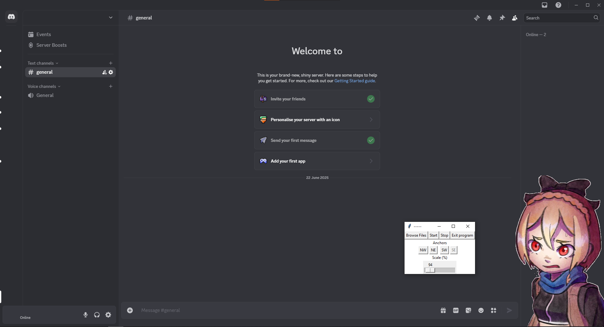

### Usage
Choose an image or video. It will be set to start by default. Press stop to change it. 
Image will be overlayed when Discord is the active window. 
To position image drag it with mouse to a desired place. Relative distance to the picked anchor will be used for future placement. 
Scale setting allows to size the image down if needed.
##### User settings
Your settings will be saved for future sessions and will load automatically without need to do it manually. 
So to use your previous setup you dont need to start anything, just run the app itself and enjoy your Discord.
##### Suggestion
You can replace Discord launch shortcut with the provided .bat file to start the overlay app alongside Discord. Just change the paths to files in the .bat file.
##### Illustration
